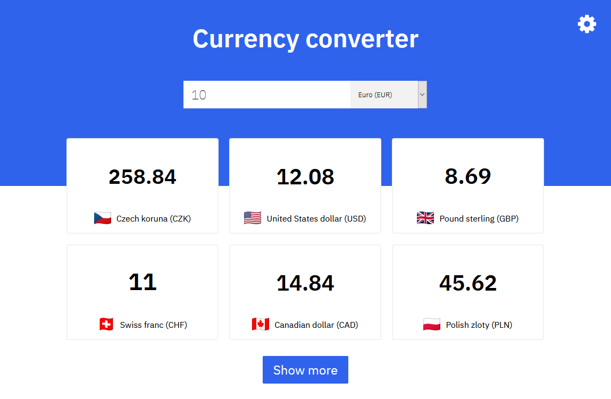

# currency-converter
A currency converter made with ReactJS.



## Production build
```
git clone https://github.com/liskapolarni/currency-converter
cd currency-converter
npm run build
```

## Thanks to:
* [Float Rates](http://www.floatrates.com) for providing an exchange rate API
* [Flagpedia](https://www.flagpedia.net) for hosting images of country flags
